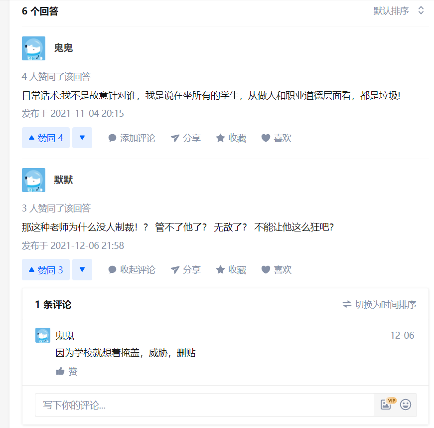
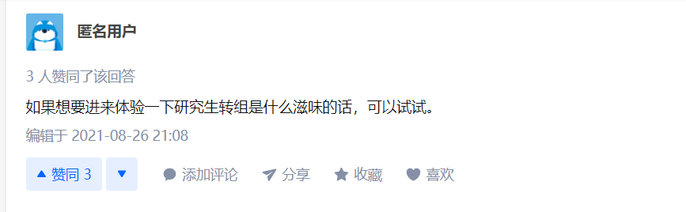
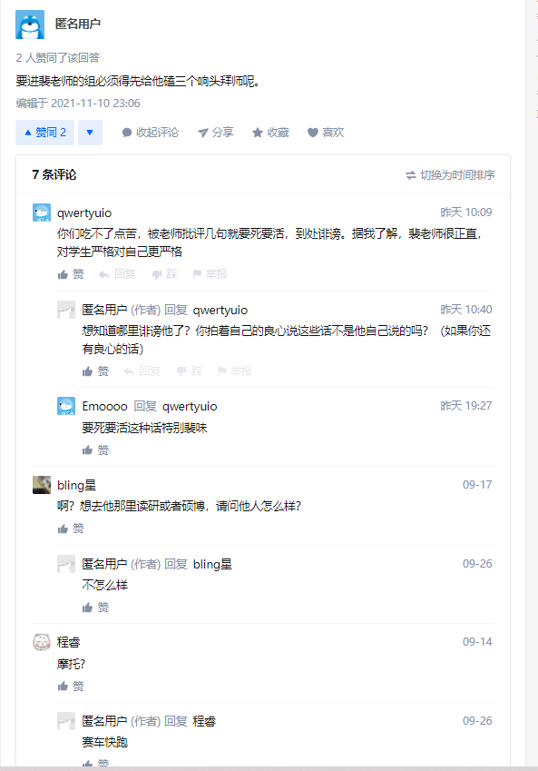
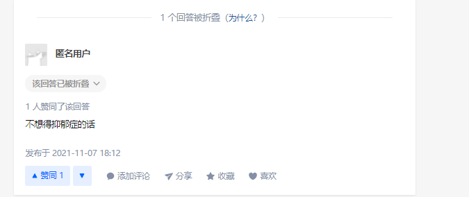

# 同济大学裴艳中劣迹

## 1.项目背景

#### 本项目的前身是知乎的提问     如何评价同济大学裴艳中老师？去他组里读研是好选择吗？http://www-quic.zhihu.com/question/482401318   据了解，知乎帖子是为了警醒后面的师弟师妹不要入坑，有一个师德极差的老板  奈何由于国内唯论文论的氛围 据帖子评论称 此人及学院发现此贴后想掩盖事实，威胁删贴。为了正义声音消失，设立本项目,为握有此人劣迹的人证据的人提供一个不会被删帖的公布路径，同时为未来可能的ff行动留下线索证据。

## 2.知乎原帖情况

## 3.一些线索陈列

#### 1.不当言论

1.我不是故意针对谁，我是说在坐所有的学生，从做人和职业道德层面看，都是垃圾!

2.要进裴老师的组必须得先给他磕三个响头拜师呢。

3.得抑郁症的人就该去自杀!

#### 2.经济问题

1.视科研经费如同私产

2.此人财务问题曾有学生向学院举报，但学校掩盖，压了下来

3.此人靠卖仪器套现，有相关公司

### 3.人身攻击

1.其组内女生偏多，对多名学生（无论男女）进行过人身攻击，导致多人情绪崩溃痛哭

2.有多人因为此人师德转组，且转组过程艰难无比，转组比例奇高。

### 4.让学生处理与科研无关的私人事务

1.包括拿快递

2.在疫情防控期间，不向学校报备，让家人违反防疫政策进入校园

### 5.作风问题

1.组内貌似发生过陪酒事件，该当事学生随后转组

